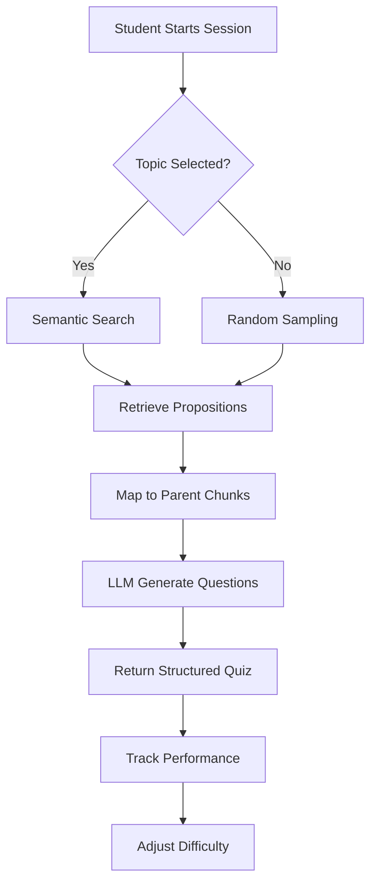
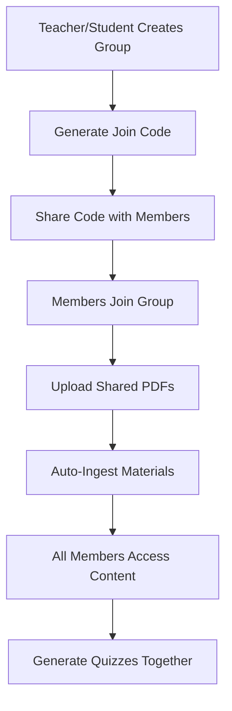

# 🐓 Rooster-HackCrypt

> **AI-Powered Adaptive Learning Platform** - Transform any learning material into an intelligent, gamified study experience

[]()
[]()
[]()
[]()

**Built for HackCrypt 2026** | January 17, 2026

---

## 🎯 What is Rooster-HackCrypt?

Rooster-HackCrypt is an **intelligent learning companion** that transforms traditional study materials into an engaging, adaptive learning experience. Using advanced RAG (Retrieval-Augmented Generation) technology, it creates personalized quizzes, instant study guides, and AI-powered tutoring—all grounded in your actual course materials.

### The Problem We Solve
- 📚 Students struggle with passive reading of dense materials
- 🎯 One-size-fits-all quizzes don't adapt to individual learning pace
- ⏰ Creating effective study materials is time-consuming for educators
- 🤝 Collaborative studying lacks integrated tools and shared resources

### Our Solution
A **unified platform** combining:
- 🤖 **AI-Powered Quiz Generation** - Adaptive difficulty based on performance
- ⚡ **Instant Flash Notes** - Zero-cost cheat sheets from any material
- 🧠 **Smart AI Tutor** - Socratic method teaching with personalized hints
- 👥 **Collaborative Study Groups** - Share resources and learn together
- 🎨 **Gamified Experience** - Minecraft-inspired UI with XP and achievements

---

## ✨ Key Features

### 🎓 For Students

#### 📖 **Smart Quiz System**
- **Adaptive Learning**: Difficulty adjusts automatically based on your performance
- **Multiple Formats**: MCQ, True/False, Short Answer questions
- **Grind Mode**: Practice specific difficulty levels to master concepts
- **Real-time Hints**: Get Socratic-style guidance without revealing answers
- **Progress Tracking**: Monitor mastery levels across topics and materials

#### ⚡ **Flash Notes Generator**
- **Instant Summaries**: Generate cheat sheets from any material in seconds
- **Zero LLM Cost**: Facts retrieved directly from vector database
- **Interactive Flashcards**: 3D flip cards with topic-detail breakdown
- **Topic-Specific**: Filter notes by specific subjects or get comprehensive overviews

#### 🤔 **AI Doubt Solver**
- **ELI5 Explanations**: Complex concepts explained simply
- **Context-Aware**: Answers grounded in your study materials
- **Interactive Dialog**: Ask follow-up questions for deeper understanding
- **Multi-Turn Conversations**: Maintains conversation history for better context

#### 👥 **Study Groups** (NEW!)
- **Collaborative Learning**: Form groups with classmates (up to 2 members)
- **Shared Resources**: Upload PDFs accessible to all group members
- **Auto-Processing**: Materials automatically indexed for quiz generation
- **Join Codes**: Easy group access with 8-character codes
- **Group Leaderboard**: Track progress and compete with peers

### 👨‍🏫 For Teachers

#### 🎯 **QuizCraft Portal**
- **Drag & Drop Upload**: Support for PDF, TXT, DOC, DOCX files
- **Instant Quiz Generation**: AI creates quizzes from any document
- **Configurable Settings**: Control question count, difficulty, and types
- **Analytics Dashboard**: Monitor student performance and engagement
- **Material Management**: Track all uploaded resources in one place

#### 📊 **Analytics & Insights**
- **Performance Metrics**: View completion rates and average scores
- **Student Progress**: Individual and class-wide performance tracking
- **Achievement System**: Gamified milestones for engagement
- **XP Tracking**: Monitor student effort and consistency

---

## 🛠️ Technology Stack

### Backend Architecture
```
Python + FastAPI + LangChain + ChromaDB
```

| Component | Technology | Purpose |
|-----------|-----------|---------|
| **Web Framework** | FastAPI | High-performance async API |
| **AI Orchestration** | LangChain + LangGraph | RAG pipeline & stateful agents |
| **LLM Provider** | Groq (`llama-3.1-8b-instant`) | Fast, cost-effective inference |
| **Embeddings** | HuggingFace (`paraphrase-MiniLM-L3-v2`) | Semantic search capabilities |
| **Vector Database** | ChromaDB | Persistent vector storage |
| **Document Processing** | PyPDFLoader, Unstructured | Multi-format ingestion |
| **Video Transcripts** | youtube-transcript-api | YouTube content extraction |

### Frontend Stack
```
HTML5 + CSS3 + Vanilla JavaScript
```

| Component | Technology | Purpose |
|-----------|-----------|---------|
| **UI Framework** | Vanilla JS + Web Components | Lightweight, fast rendering |
| **Styling** | Custom CSS (Minecraft-inspired) | Pixel-art aesthetic |
| **Icons** | Lucide Icons | Modern, crisp iconography |
| **Animations** | Anime.js | Smooth transitions |
| **Fonts** | Press Start 2P, VT323 | Retro gaming aesthetic |

### Features Implementation

#### 🎯 **Proposition-Based RAG**
Instead of simple chunk embedding, we decompose documents into **atomic facts** (propositions):
```
Original: "Python is a high-level programming language created by Guido van Rossum in 1991."

Propositions:
• Python is a high-level programming language
• Python was created by Guido van Rossum
• Python was created in 1991
```

**Benefits:**
- Higher retrieval precision (match specific facts, not entire paragraphs)
- Better context for quiz generation
- Accurate flash note creation

#### 🧠 **Adaptive Difficulty Engine**
```python
# Tracks performance per user, topic, and material
session_state = {
    "current_difficulty": "MEDIUM",
    "mastery_level": 0.65,
    "consecutive_correct": 3,
    "total_attempted": 10
}

# Auto-adjusts based on performance thresholds
if performance > 80%: difficulty ↑
if performance < 50%: difficulty ↓
```

#### ⚡ **Zero-Cost Flash Notes**
Traditional approach (expensive):
```
Document → LLM Summary → Output
Cost: ~$0.01 per request
```

Our approach (free):
```
Document → Vector DB → Direct Retrieval → Output
Cost: $0.00 per request
```

---

## 📁 Project Structure

```
Rooster-HackCrypt/
├── backend/
│   ├── api/                      # FastAPI application
│   │   ├── main.py              # API entry point
│   │   ├── routers/             # Endpoint modules
│   │   │   ├── ingestion.py    # Material upload
│   │   │   ├── quiz.py          # Quiz generation
│   │   │   ├── flashnotes.py   # Flash notes
│   │   │   ├── doubt_solver.py # AI tutor
│   │   │   ├── smart_learning.py # Socratic hints
│   │   │   └── groups.py        # Study groups (NEW!)
│   │   └── models/              # Pydantic schemas
│   ├── src/
│   │   ├── agents/              # LangGraph quiz agent
│   │   ├── core/                # Adaptive engine
│   │   ├── features/            # Feature implementations
│   │   │   ├── quiz_generation_main.py
│   │   │   ├── flash_note_generator.py
│   │   │   ├── doubt_solver.py
│   │   │   ├── smart_learning.py
│   │   │   └── grind_mode.py
│   │   ├── rag/                 # Ingestion & storage
│   │   │   ├── ingestion_main.py
│   │   │   ├── storage.py
│   │   │   └── pre_processor.py
│   │   └── models/              # Data schemas
│   ├── data/                    # Vector DB & cache
│   │   ├── chroma_db/          # ChromaDB storage
│   │   └── docstore/           # Document store
│   └── requirements.txt
│
├── fontend/                     # Frontend application
│   ├── index.html              # Landing page
│   ├── login.html              # Auth page
│   ├── dashboard.html          # Student dashboard
│   ├── teacher.html            # Teacher portal
│   ├── scripts/
│   │   ├── api/                # API clients
│   │   │   ├── client.js       # Base HTTP client
│   │   │   ├── quiz.js         # Quiz API
│   │   │   ├── flashnotes.js   # Flash notes API
│   │   │   ├── groups.js       # Study groups API (NEW!)
│   │   │   └── materials.js    # Material management
│   │   ├── components/         # UI components
│   │   │   ├── quiz-system.js  # Quiz interface
│   │   │   ├── flashnotes-panel.js # Flash cards UI
│   │   │   └── study-groups.js # Group collaboration (NEW!)
│   │   └── cyber-app.js        # Main app logic
│   ├── styles/
│   │   ├── cyber-engine.css    # Core styles
│   │   ├── quiz.css            # Quiz UI
│   │   ├── components.css      # Reusable components
│   │   └── teacher.css         # Teacher portal
│   └── assets/
│       └── pixel_art/          # Minecraft-themed assets
│
└── docs/                        # Documentation
    ├── API_README.md
    ├── Flashcard_Readme.md
    ├── DoubtSolver_Readme.md
    └── SmartLearning_Readme.md
```

---

## 🚀 Getting Started

### Prerequisites
- **Python 3.10+**
- **Groq API Key** (free tier available)

### Installation

1. **Clone the repository**
```bash
git clone https://github.com/yourusername/Rooster-HackCrypt.git
cd Rooster-HackCrypt
```

2. **Set up environment**
```bash
# Create .env file in root
echo "GROQ_API_KEY=your_groq_api_key_here" > .env
```

3. **Install dependencies**
```bash
pip install -r backend/requirements.txt
```

### Running the Application

#### Backend (API Server)
```bash
cd backend/api
uvicorn main:app --reload --port 8000
```

API will be available at: `http://localhost:8000`
- **Swagger Docs**: http://localhost:8000/docs
- **ReDoc**: http://localhost:8000/redoc

#### Frontend (Development Server)
```bash
cd fontend
python -m http.server 5500
```

Access the app at: `http://localhost:5500`

---

## 💡 How It Works

### 1️⃣ Material Ingestion Pipeline


**Process:**
1. Document uploaded via API or teacher portal
2. Text extracted and split into semantic chunks (~3000 chars)
3. LLM decomposes chunks into atomic propositions
4. Propositions embedded using HuggingFace model
5. Stored in ChromaDB with metadata (source_id, topic, etc.)
6. Original chunks preserved in docstore for context retrieval

### 2️⃣ Quiz Generation Flow



### 3️⃣ Flash Notes Generation


**Why it's fast:**
- No LLM calls required
- Direct vector similarity search
- Pre-indexed propositions ready for retrieval

### 4️⃣ Study Groups Workflow



---

## 🎮 User Guide

### For Students

#### Starting a Quiz
1. Navigate to **Dashboard**
2. Select **Practice** or **Study Groups**
3. Choose a material source
4. Select topic (or "default" for all content)
5. Pick difficulty level or enable **Adaptive Mode**
6. Answer questions and get instant feedback!

#### Using Flash Notes
1. Click **⚡ Flash Notes** button
2. Select material from dropdown
3. (Optional) Enter specific topic
4. Click **Load** to generate flashcards
5. Click cards to flip and review

#### Joining Study Groups
1. Go to **Collaborate** section
2. Click **🔗 Join by Code**
3. Enter 8-character join code
4. Start learning with peers!

### For Teachers

#### Creating Quizzes
1. Open **Teacher Portal** (teacher.html)
2. Upload document (PDF/DOC/DOCX/TXT)
3. Configure quiz settings:
   - Title
   - Number of questions (5-25)
   - Difficulty level
   - Question types
4. Click **Generate Quiz**
5. Share with students!

#### Viewing Analytics
1. Navigate to **Analytics** tab
2. View metrics:
   - Total quizzes created
   - Student attempts
   - Completion rates
   - Average scores
3. Track individual student progress

---

## 📡 API Reference

### Core Endpoints

#### Material Ingestion
```http
POST /api/v1/ingest/pdf
Content-Type: multipart/form-data

{
  "file": <PDF_FILE>,
  "source_id": "python_basics"
}
```

#### Quiz Generation
```http
POST /api/v1/sessions/adaptive
Content-Type: application/json

{
  "user_id": "student_001",
  "source_id": "python_basics",
  "topic": "default",
  "initial_difficulty": "MEDIUM"
}
```

#### Flash Notes
```http
GET /api/v1/cheat-sheet?topic=variables&source_id=python_basics&num_facts=20
```

#### Study Groups (NEW!)
```http
POST /api/v1/groups/create
Content-Type: application/json

{
  "name": "Python Study Squad",
  "creator_id": "user_123",
  "description": "Learning Python together",
  "public": true
}
```

**Full API Documentation:** [API_README.md](API_README.md)

---

## 🎨 UI Features

### Minecraft-Inspired Design
- **Pixel Art Aesthetic**: Retro gaming feel with modern functionality
- **Press Start 2P Font**: Authentic pixel font for headings
- **Block-Style Buttons**: Minecraft-inspired 3D button effects
- **XP System**: Earn experience points for completing quizzes
- **Achievement Badges**: Unlock milestones as you progress

### Interactive Elements
- **3D Flip Cards**: Flashcards with smooth rotation animations
- **Hover Effects**: Visual feedback on all interactive elements
- **Progress Bars**: Real-time mastery level indicators
- **Toast Notifications**: Non-intrusive success/error messages
- **Modal Overlays**: Clean dialog boxes for actions

---

## 🔬 Technical Deep Dive

### RAG Architecture

**Traditional Chunking Issues:**
- Large chunks → poor semantic matching
- Small chunks → loss of context
- Fixed-size chunks → arbitrary splits

**Our Solution: Proposition Decomposition**
```python
# Example: Physics textbook paragraph
original_chunk = """
Newton's First Law states that an object at rest stays at rest 
and an object in motion stays in motion with the same speed and 
direction unless acted upon by an unbalanced force.
"""

# Decomposed into atomic facts
propositions = [
    "Newton's First Law describes object motion",
    "An object at rest stays at rest",
    "An object in motion stays in motion",
    "Motion continues at the same speed",
    "Motion continues in the same direction",
    "Force is required to change motion",
    "The force must be unbalanced"
]
```

**Benefits:**
1. **Higher Precision**: Match exact concepts, not paragraphs
2. **Better Context**: Multiple related facts retrieved together
3. **Flexible Retrieval**: Mix and match facts from different sources

### Adaptive Learning Algorithm

```python
class AdaptiveEngine:
    def adjust_difficulty(self, performance: float):
        if performance >= 0.8:  # 80%+ correct
            self.difficulty = min(self.difficulty + 1, 5)
        elif performance <= 0.5:  # <50% correct
            self.difficulty = max(self.difficulty - 1, 1)
        
        self.mastery += self.calculate_mastery_delta(performance)
```

### Study Groups Architecture

**Shared Resource Management:**
```python
# Group structure in GlobalState
group = {
    "group_id": "grp_abc123",
    "name": "AI Study Squad",
    "join_code": "ABCD1234",  # 8-char alphanumeric
    "members": ["user_1", "user_2"],
    "resources": ["pdf_source_1", "pdf_source_2"],
    "public": True,
    "max_members": 2
}
```

**Resource Sharing Flow:**
1. Member uploads PDF to group
2. PDF ingested with group metadata
3. Propositions tagged with group_id
4. All members can generate quizzes from shared content
5. Group leaderboard tracks collective progress

---

## 📊 Performance & Scalability

### Benchmarks
- **Quiz Generation**: ~2-3 seconds (including LLM inference)
- **Flash Notes**: <500ms (direct vector retrieval)
- **Document Ingestion**: ~1-2 min per 100-page PDF
- **Semantic Search**: <100ms for top-20 results

### Optimization Strategies
1. **Embedding Cache**: Local HuggingFace model storage
2. **Proposition Indexing**: Pre-decomposed facts for instant retrieval
3. **Async Processing**: FastAPI async endpoints for concurrency
4. **Rate Limiting**: Intelligent LLM call management
5. **Docstore Mapping**: Fast parent chunk retrieval

---

## 🎯 Use Cases

### 1. **Self-Paced Learning**
Students upload textbooks → Generate personalized quizzes → Track progress → Master concepts at their own pace

### 2. **Classroom Integration**
Teachers upload lecture notes → Create quizzes for class → Monitor student performance → Identify struggling students

### 3. **Exam Preparation**
Upload syllabus + past papers → Generate practice questions → Use grind mode for weak topics → Track mastery levels

### 4. **Collaborative Study**
Form study group → Share PDF resources → Generate group quizzes → Compete on leaderboard → Learn together

### 5. **Quick Reference**
Generate flash notes from any material → Review key concepts → Export as study guides → Share with peers

---

## 🛣️ Roadmap

### ✅ Completed (v1.0 - Current)
- [x] RAG-based ingestion pipeline
- [x] Adaptive quiz generation
- [x] Flash notes generator
- [x] AI doubt solver with ELI5
- [x] Socratic hints system
- [x] Study groups with shared resources
- [x] Teacher portal with analytics
- [x] Minecraft-themed UI
- [x] Complete REST API

### 🚧 In Progress (v1.1)
- [ ] User authentication & accounts
- [ ] Persistent user progress tracking
- [ ] Enhanced analytics dashboard
- [ ] Mobile-responsive design
- [ ] Multi-language support

### 🔮 Future Enhancements (v2.0)
- [ ] Real-time collaborative quizzes
- [ ] Video content support (beyond transcripts)
- [ ] Spaced repetition algorithm
- [ ] Social features (friends, challenges)
- [ ] Export study materials (PDF, Anki)
- [ ] Integration with LMS platforms
- [ ] Voice-enabled doubt solver
- [ ] AR/VR learning experiences

---

## 🤝 Contributing

We welcome contributions! Please see our [Contributing Guide](CONTRIBUTING.md) for details.

### Development Setup
```bash
# Create virtual environment
python -m venv venv
source venv/bin/activate  # or venv\Scripts\activate on Windows

# Install dev dependencies
pip install -r backend/requirements.txt

# Run tests
pytest backend/tests/

# Start development servers
# Terminal 1: Backend
cd backend/api && uvicorn main:app --reload

# Terminal 2: Frontend
cd fontend && python -m http.server 5500
```

---

## 📝 License

This project is licensed under the MIT License - see the [LICENSE](LICENSE) file for details.

---

## 🙏 Acknowledgments

- **HackCrypt 2026** - For the opportunity to build this amazing project
- **Groq** - For providing fast, affordable LLM inference
- **LangChain** - For excellent RAG orchestration tools
- **ChromaDB** - For powerful vector search capabilities
- **HuggingFace** - For open-source embeddings models

---

## 📧 Contact

**Team Rooster**
- Email: rooster@hackcrypt.dev
- GitHub: [@rooster-hackcrypt](https://github.com/rooster-hackcrypt)
- Demo: [rooster-hackcrypt.vercel.app](https://rooster-hackcrypt.vercel.app)

---

<div align="center">

**Made with ❤️ for HackCrypt 2026**

⭐ Star us on GitHub if you find this project useful!

</div>

- Are **grounded in your source content** via Retrieval-Augmented Generation (RAG)
- Support **adaptive difficulty** (keeps learners in “flow”) or fixed **grind mode** practice
- Provide **instant flash-note generation** (zero LLM cost cheat sheets)
- Offer **AI-powered doubt solving** with ELI5 explanations
- Include **Smart Learning features** (Socratic hints + session analysis)
- Work from multiple material sources:
    - **PDFs**
    - **YouTube videos** (transcripts)
    - **Syllabus topics** (LLM-generated chapter text)

The core idea: store *semantic facts* (propositions) for retrieval, enable both quiz generation and instant fact access.

---

## ✨ Key Features

### 🎯 Quiz Generation
- **Adaptive Mode**: Automatically adjusts difficulty based on performance
- **Grind Mode**: Practice at fixed difficulty levels
- **RAG-Grounded**: Questions sourced from your actual learning materials

### ⚡ Flash-Note Generator
- **Zero LLM Cost**: Retrieves facts directly from vector store
- **Instant Cheat Sheets**: Get quick summaries without waiting for LLM
- **Context-Aware**: Uses semantic search for relevant information

### 🤔 Doubt Solver (AI Tutor)
- **ELI5 Explanations**: Breaks down complex concepts into simple terms
- **Interactive Learning**: Uses LangGraph for stateful conversations
- **Contextual Help**: Answers based on your uploaded materials

### 🧠 Smart Learning
- **Socratic Hints**: Get guiding questions instead of direct answers
- **AI Sensei**: Session analysis with personalized feedback
- **Pattern Recognition**: Identifies knowledge gaps and misconceptions

### 👥 Study Groups (NEW!)
- **Collaborative Learning**: Form groups of up to 2 students
- **Shared Resources**: Upload PDFs accessible to all group members
- **Automatic Ingestion**: Uploaded materials indexed for quizzes
- **Group Management**: Create, join, and manage study groups

---

## Core Concepts (The “Why”)

### Proposition Decomposition
Instead of embedding raw chunks only, the ingestion pipeline can decompose text into atomic facts ("propositions").
This increases retrieval precision because the vector DB matches to fine-grained factual statements.

### Hybrid Storage (RAG + Reconstruction)
Rooster uses a two-tier store:

- **ChromaDB** stores proposition embeddings for fast semantic search
- A persistent **docstore** (pickle) stores the original “parent” chunks so retrieval can return full context

### Adaptive Learning
An adaptive engine tracks performance and adjusts difficulty over time for a given session, topic, and source.
You can also bypass adaptation and do fixed-difficulty practice (grind mode).

---

## Tech Stack

### Backend
- **Python** (CLI-driven MVP)
- **LangChain + LangGraph**: RAG orchestration and stateful agent workflow
- **Groq (langchain-groq)**: LLM inference (configured as `llama-3.1-8b-instant`)
- **HuggingFace Embeddings (langchain-huggingface)**: local embeddings
    - Model: `sentence-transformers/paraphrase-MiniLM-L3-v2`
- **ChromaDB**: persistent local vector DB

### Document / Content Ingestion
- **PyPDFLoader** (LangChain community)
- **unstructured[pdf]** + OCR utilities (optional): `pytesseract`, `pdf2image`, `pillow`
- **youtube-transcript-api**: transcript retrieval
- **requests + beautifulsoup4**: URL scraping utilities (used by URL loader patterns)

---

## System Architecture (High Level)

At a high level, the system is split into:

1. **Ingestion service**: takes source material → produces parent chunks + propositions → indexes storage
2. **Knowledge base**: persistent store for retrieval (vector + docstore)
3. **Quiz agent**: retrieves context + prompts LLM → structured quiz output
4. **Flash-note generator**: retrieves raw propositions for instant cheat sheets (zero LLM cost)
5. **Doubt solver**: AI tutor that provides ELI5 explanations for student questions
6. **Smart learning**: Socratic hints and session analysis for advanced pedagogy
7. **Session engines**: track learner state, difficulty, mastery over time
8. **FastAPI REST API**: Exposes all features via HTTP endpoints
9. **CLI demo**: ties everything together end-to-end

### Component Map

```
                    ┌───────────────────────┐
                    │   CLI Demo (Menu)     │
                    │ backend/testing/demo.py│
                    └───────────┬───────────┘
                                │
                 ┌──────────────┴───────────────┐
                 │                              │
                 ▼                              ▼
┌─────────────────────────────┐   ┌────────────────────────────┐
│ IngestionService            │   │ FastAPI REST API           │
│ src/rag/ingestion_main.py   │   │ backend/api/main.py        │
└───────────┬─────────────────┘   └────────────┬───────────────┘
            │ produces                          │
            │ parent chunks + propositions      │
            ▼                                   │
┌───────────────────────────────┐              │
│ KnowledgeBase                 │◄─────────────┘
│ src/rag/storage.py            │
│  - ChromaDB (propositions)    │
│  - Docstore (parent docs)     │
└───────────┬───────────────────┘
            │ retrieves context
            ▼
┌───────────────────────────────┐  ┌────────────────────────────┐
│ QuizAgent (LangGraph)         │  │ FlashNoteGenerator         │
│ src/agents/agent.py           │  │ src/features/flash_note... │
└───────────┬───────────────────┘  └────────────┬───────────────┘
            │ generates quizzes                 │ zero-cost facts
            ▼                                   ▼
┌───────────────────────────────┐  ┌────────────────────────────┐
│ AdaptiveLogic / Difficulty    │  │ DoubtSolverAgent           │
│ src/core/logic_engine.py      │  │ src/features/doubt_solver  │
│ src/core/difficulty_engine.py │  │ ELI5 explanations          │
└───────────────────────────────┘  └────────────────────────────┘
                                   ┌────────────────────────────┐
                                   │ Smart Learning (NEW)       │
                                   │ src/features/smart_learn.. │
                                   │ - Socratic Hints           │
                                   │ - Session Analysis         │
                                   └────────────────────────────┘
```

---

## Data Flow (End-to-End)

### 1) Ingestion Pipeline
Entry points: `src/rag/ingestion_main.py`

**For PDF**
1. Load PDF → split into parent chunks (~3000 chars)
2. Decompose chunks into propositions (LLM) with rate-limit-aware fallbacks
3. Store:
     - propositions → ChromaDB (with `pdf_source_id` metadata)
     - parent chunks → docstore pickle (with `pdf_source_id` metadata)

**For YouTube**
1. Extract video ID from URL
2. Fetch transcript text
3. Split into parent chunks → index like PDFs (with `pdf_source_id`)

**For Syllabus**
1. LLM generates a chapter-style document for the topic
2. Split into parent chunks → index like PDFs (with `pdf_source_id`)

### 2) Retrieval + Quiz Generation
Entry points: `src/features/quiz_generation_main.py`, `src/agents/agent.py`

1. User starts a session: `pdf_source_id` + `topic` + mode
2. Agent retrieves context:
     - If `topic == "default"`: sample random parent docs from the selected source
     - Else: semantic search propositions in ChromaDB → map to parent docs in docstore
3. LLM generates a quiz from retrieved context (structured JSON format)
4. Session engine updates mastery/difficulty based on results

---

## Persistence & Data Directories (Important)

The knowledge base stores data on disk:

- ChromaDB: `./data/chroma_db`
- Docstore: `./data/docstore/documents.pkl`

**These paths are relative to your current working directory when you run the program.**

That means if you run the demo from different folders, you can accidentally create multiple independent databases.

Recommended approach:

- Always run the CLI from the same directory (see “Run” below)

---

## Repository Structure (Actual)

```
.
├─ README.md
├─ API_README.md                 # FastAPI documentation
├─ backend/
│  ├─ requirements.txt
│  ├─ run_api.py                 # API server launcher
│  ├─ api/                       # FastAPI application
│  │  ├─ main.py                 # API entry point
│  │  ├─ config.py               # Settings/environment
│  │  ├─ routers/                # Endpoint routers
│  │  │  ├─ health.py            # Health checks
│  │  │  ├─ materials.py         # Material listing
│  │  │  ├─ ingestion.py         # PDF/YouTube/Syllabus upload
│  │  │  ├─ quiz.py              # Quiz & session management
│  │  │  ├─ flashnotes.py        # Flash-note generation
│  │  │  ├─ doubt_solver.py      # Doubt solver
│  │  │  └─ smart_learning.py    # Socratic hints + session analysis (NEW)
│  │  ├─ services/               # Business logic
│  │  ├─ models/                 # Pydantic request/response models
│  │  └─ middleware/             # Error handling
│  ├─ src/
│  │  ├─ agents/                 # LangGraph quiz agent
│  │  ├─ core/                   # Adaptive engine + difficulty config
│  │  ├─ features/               # Quiz/session + flash-note generator
│  │  │  ├─ quiz_generation_main.py
│  │  │  ├─ flash_note_generator.py
│  │  │  ├─ doubt_solver.py      # AI tutor
│  │  │  └─ smart_learning.py    # Socratic hints + session analysis (NEW)
│  │  ├─ loaders/                # PDF/YouTube/Syllabus loaders
│  │  ├─ rag/                    # ingestion + storage + preprocessing
│  │  └─ models/                 # pydantic schemas
│  ├─ testing/                   # CLI demo + dev scripts
│  └─ data/                      # embedding cache (and optional local data)
├─ data/                         # additional caches/data (workspace-level)
└─ docs/                         # design notes, checkpoints
   ├─ Flashcard_Readme.md        # Flash-note feature documentation
   ├─ DoubtSolver_Readme.md      # Doubt solver feature documentation
   ├─ SmartLearning_Readme.md    # Smart Learning features documentation (NEW)
   └─ ...
```

---

## Setup

### Prerequisites
- Python 3.10+
- A `.env` file containing:

```
GROQ_API_KEY=...
```

### Install

From repo root:

```bash
pip install -r backend/requirements.txt
```

---

## Run (CLI Demo)

The primary testing UI is the menu-driven CLI:

```bash
cd backend/testing
python demo.py
```

From the menu you can:

- Ingest PDFs
- Ingest YouTube transcript URLs
- Generate syllabus content
- Start Adaptive sessions and generate quizzes
- Run Grind Mode practice

Tip: when prompted for topic, type `default` to generate questions from the entire selected source.

---

## Run (FastAPI Server)

For frontend integration or API access:

```bash
cd backend

# Activate virtual environment (Windows)
..\venv\Scripts\Activate.ps1

# Run the API server
uvicorn api.main:app --port 8000
```

Server will start at `http://localhost:8000`

**Interactive Documentation:**
- Swagger UI: http://localhost:8000/docs
- ReDoc: http://localhost:8000/redoc

**Key Endpoints:**
- `POST /api/v1/ingest/pdf` - Upload PDF files
- `POST /api/v1/ingest/youtube` - Ingest YouTube videos
- `POST /api/v1/sessions/adaptive` - Create adaptive quiz session
- `POST /api/v1/sessions/{id}/quiz` - Generate quiz
- `GET /api/v1/cheat-sheet` - **Flash-note generator**
- `POST /api/v1/solve-doubt` - **AI tutor for doubts**
- `POST /api/v1/hint/socratic` - **Socratic hints**
- `POST /api/v1/analyze-session` - **Session analysis**
- `POST /api/v1/groups/create` - **Create study group (NEW!)**
- `POST /api/v1/groups/join` - **Join study group (NEW!)**
- `GET /api/v1/groups` - **List all study groups (NEW!)**
- `GET /api/v1/groups/{group_id}` - **Get study group details (NEW!)**
- `POST /api/v1/groups/{group_id}/upload` - **Upload shared resources (NEW!)**
- `GET /api/v1/groups/{group_id}/resources` - **List group resources (NEW!)**

See [API_README.md](API_README.md) for complete API documentation.

---

## Troubleshooting

### “No documents found in source”
- Make sure you are selecting the correct `pdf_source_id` from the menu.
- Ensure you’re running the demo from the same working directory you used when ingesting.
    - Example: If you ingested while in `backend/testing`, run quizzes from `backend/testing` too.

### YouTube transcript issues
- Some videos have captions disabled or unavailable.
- The loader depends on `youtube-transcript-api`, which can fail for:
    - transcripts disabled
    - region restrictions
    - age-restricted videos

### Embeddings model not found
Embeddings are configured with `local_files_only=True`. Ensure the model is cached under:

- `backend/data/embeddings_cache/`

If you’re moving machines, you may need to download the model once (via normal HuggingFace behavior) and keep it cached.

---

## Project Status & Roadmap

### ✅ Completed (v1.0 - Current)

**Core Infrastructure:**
- ✅ RAG-based ingestion pipeline (PDF, YouTube, Syllabus)
- ✅ ChromaDB vector storage + Docstore
- ✅ Proposition decomposition for semantic search
- ✅ FastAPI REST API with 7 routers, 15+ endpoints
- ✅ CLI demo interface

**Learning Features:**
- ✅ Adaptive quiz generation with difficulty tracking
- ✅ Grind mode (fixed difficulty practice)
- ✅ Flash-note generator (zero-cost fact retrieval)
- ✅ Doubt Solver (ELI5 AI tutor with LangGraph)
- ✅ Socratic Hints (guided learning questions)
- ✅ AI Sensei (session analysis & feedback)
- ✅ **Study Groups** - Collaborative learning with shared resources

**Documentation:**
- ✅ Complete API documentation ([API_README.md](API_README.md))
- ✅ Feature-specific guides ([docs/](docs/))
- ✅ Integration examples (React, Python)

### 🚧 Future Enhancements

**Frontend:**
- [ ] React/Next.js web application
- [ ] Student dashboard with progress tracking
- [ ] Material upload interface
- [ ] Interactive quiz interface
- [ ] Study group management UI

**Features:**
- [ ] Multi-language support
- [ ] Collaborative learning (group sessions)
- [ ] Visual analytics and progress charts
- [ ] Spaced repetition integration
- [ ] Export/import study materials
- [ ] Enhanced group features (chat, shared notes)

**Infrastructure:**
- [ ] User authentication (JWT)
- [ ] PostgreSQL for user data
- [ ] Redis caching layer
- [ ] Deployment guides (Docker, cloud)

---

## Notes

- Backend is fully functional and production-ready
- API designed for easy frontend integration
- All features thoroughly documented
- Session management supports stateful learning workflows
